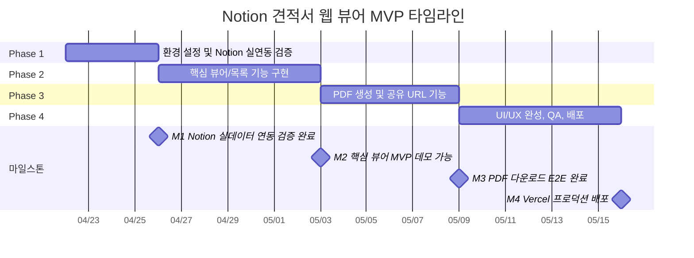

# Notion 기반 견적서 웹 뷰어 개발 로드맵

> 최종 업데이트: 2026-04-23 | 버전: v1.6 (Phase 4 구현 완료 — Vercel 배포·스모크 테스트 진행 중)

## 프로젝트 개요

**제품명**: Notion 기반 견적서 웹 뷰어 (Invoice Web Viewer)

사업자가 Notion 데이터베이스에 입력한 견적서를, 고객에게 고유 URL로 공유하여 웹에서 열람하거나 PDF로 다운로드할 수 있도록 하는 1인 사업자용 MVP 서비스입니다. 별도의 견적서 편집 UI를 개발하지 않고 Notion을 데이터 저장·편집 레이어로 그대로 활용하여 개발/운영 비용을 최소화합니다.

### 핵심 가치

- **사업자(어드민)**: Notion만으로 견적서를 작성·관리하고, 어드민 대시보드에서 공유 URL을 복사해 고객에게 전달
- **고객(클라이언트)**: 별도 로그인 없이 URL 접속만으로 깔끔한 웹 뷰어에서 견적서 확인 및 PDF 저장
- **배포**: Vercel 단일 인스턴스로 호스팅, 별도 DB 운영 불필요

### 대상 릴리스

- MVP (v1.0): 본 로드맵 범위
- 릴리스 플랫폼: Vercel
- 릴리스 환경: 프로덕션 단일 환경 + 미리보기(PR preview)

---

## 목표 및 성공 지표

### 비즈니스 목표

- 사업자가 Notion 입력 완료 후 **5분 이내**에 고객에게 견적서 URL을 공유 가능해야 함
- 고객이 URL 수신 후 **3회 이내 클릭·탭**으로 PDF 다운로드까지 완료 가능해야 함

### 기술 목표

- Next.js 16 App Router + React 19 기반 서버 컴포넌트 우선 설계
- TypeScript strict 모드 100% 준수 (any 타입 0건)
- 공개 뷰어 페이지 LCP 2.5s 이하 (Vercel Edge 기준)
- 라이트하우스 접근성 점수 90점 이상

### 측정 가능한 KPI

| 지표 | 목표값 | 측정 방법 |
|---|---|---|
| 견적서 목록 조회 응답 시간 | p95 < 800ms | Vercel Analytics |
| 공개 뷰어 LCP | < 2.5s | Lighthouse CI |
| PDF 다운로드 성공률 | > 98% | 클라이언트 이벤트 로깅 (Phase 4) |
| 빌드 성공률 | 100% | Vercel 빌드 로그 |
| 타입 오류/린트 오류 | 0건 | `npm run lint` |

---

## 현재 상태 (2026-04-23 기준 완료 항목)

프로젝트는 이미 스캐폴딩 및 기초 연동이 상당 부분 완료된 상태입니다. 본 로드맵은 **완료된 항목을 재작업하지 않는 것을 원칙**으로, 남은 작업에 집중합니다.

### 완료된 항목

- [x] Next.js 16 App Router 프로젝트 초기화
- [x] TypeScript strict, Tailwind CSS v4, shadcn/ui, next-themes 설정
- [x] 라우팅 구조 확립
  - `app/(dashboard)/invoices/` — 어드민 영역 (레이아웃 포함)
  - `app/(dashboard)/invoices/[id]/page.tsx` — 상세 미리보기
  - `app/quote/[slug]/page.tsx` — 공개 뷰어
  - `app/not-found.tsx` — 전역 404
- [x] 공유 컴포넌트 스캐폴딩
  - `components/invoice/InvoiceList.tsx`
  - `components/invoice/InvoiceCard.tsx`
  - `components/invoice/InvoiceViewer.tsx`
  - `components/invoice/InvoicePDF.tsx` (파일 존재, 렌더러 미구현)
  - `components/invoice/CopyUrlButton.tsx`
  - `components/layout/sidebar.tsx`, `mobile-sidebar.tsx`
- [x] 공유 타입 정의 (`types/index.ts` — `Invoice`, `InvoiceSummary`, `InvoiceItem`, `InvoiceStatus`, `NotionInvoiceProperties`)
- [x] Notion 데이터 레이어 `lib/notion.ts`
  - `@notionhq/client` v5 설치 및 연동 코드 작성 완료
  - `getInvoices()`, `getInvoiceBySlug()`, `getInvoiceById()` 구현 완료
  - 환경 변수 미설정 시 목업 데이터 폴백 동작
  - 속성 파서(title/rich_text/select/number/date/email) 구현 완료
  - 테이블 블록 → `InvoiceItem[]` 변환 로직 구현 완료
- [x] 루트 레이아웃: `ThemeProvider`, `TooltipProvider`, 타이틀 템플릿 설정

#### Phase 1 완료 항목 (2026-04-23)

- [x] Notion Integration 연결 및 실데이터 연동 검증 완료
- [x] `.env.local` 설정, `.env.local.example` 및 `README.md` 정비 (`NEXT_PUBLIC_APP_ORIGIN` 추가)
- [x] `@react-pdf/renderer` 설치 및 Next.js 16 / React 19 호환성 확인 완료
- [x] `docs/notion-schema.md` 작성 (DB 속성 9개 전체, 테이블 컬럼 규약 포함)
- [x] `docs/adr/ADR-001-pdf-library.md` 작성
- [x] Notion API rate limit 대응 `revalidate` 캐시 전략 적용 (목록 60초, 뷰어 30초)
- [x] `lib/errors.ts` 신규 생성 (`NotionApiError`, `toUserMessage()` 한국어 에러 변환)
- [x] `lib/notion.ts` 에러 핸들링 보강 (3개 public 함수 try-catch + 로깅)

#### Phase 2 완료 항목 (2026-04-23)

- [x] `lib/format.ts` 신규 생성 (`formatKRW`, `formatDate`) — 7개 파일 중복 `formatAmount` 통합
- [x] `lib/schemas/invoice.ts` 신규 생성 — Zod 스키마(`InvoiceItemSchema`, `InvoiceSummarySchema`, `InvoiceSchema`) + `lib/notion.ts` safeParse 검증 적용
- [x] 대시보드 이번 달 집계 카드 추가 (5번째 카드, `CalendarIcon`)
- [x] Zustand(`zustand`) 설치, `store/useViewStore.ts` 신규 생성 (뷰 모드 persist)
- [x] `components/invoice/InvoiceFilters.tsx` 신규 — 상태 필터/검색/정렬/뷰 토글 (URL searchParams 기반)
- [x] `components/invoice/InvoiceListView.tsx` 신규 — 리스트/그리드 뷰 전환 클라이언트 컴포넌트
- [x] `app/(dashboard)/invoices/page.tsx` — searchParams await + 서버 사이드 필터링/정렬
- [x] `components/invoice/InvoiceViewer.tsx` — `mode?: "public" | "preview"` prop 추가, preview 액션 바
- [x] `app/(dashboard)/invoices/[id]/page.tsx` — `InvoiceViewer mode="preview"` 재사용으로 리팩터
- [x] `app/quote/[slug]/page.tsx` — `robots: { index: false }`, `InvoiceViewer mode="public"` 적용
- [x] `InvoiceViewer` 테이블 `overflow-x-auto` + 금액 셀 `aria-label` 접근성 보강

> 참고: `@react-pdf/renderer` 설치 완료 (Phase 1 F103). 실제 PDF 렌더링 구현은 Phase 3(F302)에서 진행.

#### Phase 3 완료 항목 (2026-04-23)

- [x] `components/invoice/CopyUrlButton.tsx` — `navigator.clipboard` 복사 + fallback 수동복사 UI 구현 완료
- [x] `components/invoice/InvoicePDF.tsx` — `@react-pdf/renderer` A4 레이아웃, NotoSansKR 한글 폰트 내장, 항목 테이블/합계/비고/페이지 번호 구현 완료
- [x] `public/fonts/NotoSansKR-Regular.woff`, `NotoSansKR-Bold.woff` 배치 완료
- [x] `components/invoice/DownloadPdfButton.tsx` 신규 생성 — `PDFDownloadLink` + 로딩 인디케이터, `{slug}-{clientName}.pdf` 파일명 자동 생성
- [x] `app/quote/[slug]/not-found.tsx` 신규 생성 — "잘못된 주소입니다. 발급자에게 새 URL을 요청해주세요" 안내 포함
- [x] `app/quote/[slug]/page.tsx` — `robots: { index: false, follow: false }` 설정 완료
- [x] `app/quote/[slug]/page.tsx` — `headers()` 기반 slug/User-Agent/referer 서버 로그 구현 완료

#### Phase 4 완료 항목 (2026-04-23)

- [x] `components/invoice/InvoiceEmptyState.tsx` 신규 생성 — FileTextIcon + 메시지 + 설명 3단 구성, InvoiceList/InvoiceListView 인라인 빈 상태 교체
- [x] `components/layout/sidebar.tsx` — 하단 ThemeToggle 추가 (데스크톱 사이드바 다크모드 토글)
- [x] `app/(dashboard)/invoices/loading.tsx` — 스켈레톤 구조를 실제 리스트 행(flex) 구조와 일치하도록 수정
- [x] `app/globals.css` — `@media print` 블록 추가 (`.print-hidden`, `@page` A4, `invoice-item-row break-inside: avoid`, 흑백 출력 최적화)
- [x] `app/quote/[slug]/page.tsx` — PDF 버튼/헤더 영역에 `print-hidden` 클래스 적용
- [x] `components/invoice/InvoiceViewer.tsx` — 모바일 그리드 열수 불일치 버그 수정 (`grid-cols-[1fr_auto_auto] sm:grid-cols-[1fr_auto_auto_auto]`), 수신/발행 그리드 모바일 1열화, `invoice-item-row` 클래스 추가
- [x] `components/invoice/InvoiceFilters.tsx` — 검색 Input `w-full sm:w-48` 반응형 수정, `flex-wrap` 추가
- [x] `app/(dashboard)/page.tsx` — 대시보드 헤더 `flex-wrap` + 금액 `break-all` 모바일 대응
- [x] `app/(dashboard)/layout.tsx` — Skip Navigation 링크(`sr-only`) 추가, `<main id="main-content">` 연결
- [x] `components/layout/sidebar.tsx` — `<aside aria-label="사이드바 내비게이션">`, `<nav aria-label="주 내비게이션">` 추가
- [x] `app/quote/[slug]/page.tsx` — 최상위 래퍼를 `<main aria-label="견적서 뷰어">`로 교체
- [x] `components/invoice/InvoiceViewer.tsx` — 견적 내역·비고 섹션 `<section aria-labelledby>` 시맨틱, Badge `aria-label` 추가
- [x] `components/invoice/InvoiceList.tsx` — 행 Link `focus-visible:ring` 포커스 스타일 추가
- [x] `components/invoice/InvoiceCard.tsx` — 상세 보기 Link `aria-label="{title} 상세 보기"` 추가
- [x] `components/invoice/InvoiceFilters.tsx` — 정렬 select `<label sr-only>` + `id` 연결
- [x] `CLAUDE.md` — 미설치 패키지(TODO) 섹션 제거 → 설치된 주요 패키지 섹션으로 교체, 환경 변수 3종 설명 추가
- [x] `README.md` — 빠른 시작, 환경 변수, Notion 설정, Vercel 배포 절차 작성
- [x] `docs/index.md` 신규 생성 — docs/ 하위 문서 인덱스
- [x] `vercel.json` 신규 생성 — `icn1` 리전, 보안 헤더 5종(`X-Frame-Options`, `X-Content-Type-Options` 등), `/quote/(.*)` `Cache-Control: private, no-store` + `X-Robots-Tag: noindex`
- [x] `next.config.ts` — `serverExternalPackages: ["@react-pdf/renderer"]`, `images.remotePatterns` 추가, `npm run build` 성공
- [x] `docs/qa/responsive-screenshots/README.md` 신규 생성 — 4개 뷰포트 검증 가이드
- [x] `docs/qa/production-smoke-test.md` 신규 생성 — TC-01~TC-07 스모크 테스트 체크리스트 (29개 항목)
- [x] `docs/user-guide.md` 신규 생성 — 사업자용 Notion 작성 가이드, 상태 5종, FAQ 6항목, 장애 대응
- [x] `docs/adr/ADR-003-slug-url-schema.md` 신규 생성 — slug = Notion 페이지 ID UUID 직접 사용 결정 공식화 (상태: 채택)

---

## 전체 타임라인

전체 기간: **약 4주 (버퍼 포함)**

### Phase 요약

| Phase | 기간 | 목표 | 마일스톤 |
|---|---|---|---|
| Phase 1 | 약 4일 | 환경 설정 + Notion 실연동 검증 | M1: 실데이터 1건 정상 조회 |
| Phase 2 | 약 7일 | 어드민 대시보드/목록/상세, 공개 뷰어 완성 | M2: 데모 가능한 MVP 뷰어 |
| Phase 3 | 약 6일 | PDF 다운로드 + 공유 URL 복사 + 에러 처리 | M3: PDF E2E 동작 |
| Phase 4 | 약 7일 | UI/UX 다듬기, 반응형 검증, QA, Vercel 배포 | M4: 프로덕션 릴리스 |

---

## Phase 1: 환경 설정 및 Notion 연동 검증 (약 4일)

### 목표

실제 Notion 워크스페이스와 연결하여 목업이 아닌 실데이터를 화면에 표시할 수 있는 기반을 완성한다. 또한 남은 의존성 패키지를 설치하고 개발 환경 문서를 정비한다.

### 주요 태스크

- [x] **F101**: Notion Integration 및 데이터베이스 스키마 확정 (복잡도: S) — 우선순위: 🔴 Critical
  - 수용 기준:
    - Notion Integration 생성 및 API Key 발급 완료
    - 견적서 DB에 필요한 속성(Name/slug/client_name/client_email/issue_date/expiry_date/status/total_amount/note)이 `lib/notion.ts`의 `mapPageToSummary` 구현과 정확히 일치
    - 테이블 블록 컬럼 순서(항목명 | 수량 | 단가 | 금액 | 비고) 규약 문서화
  - 기술 구현 방향: Notion DB 속성명/타입을 `lib/notion.ts`가 기대하는 문자열 키와 맞추고, 테스트용 견적서 2건 이상 생성
  - 산출물: `docs/notion-schema.md` (DB 스키마 + 스크린샷 + 작성 규약)

- [x] **F102**: `.env.local` 설정 및 환경 변수 검증 (복잡도: S) — 우선순위: 🔴 Critical
  - 수용 기준:
    - `.env.local`에 `NOTION_API_KEY`, `NOTION_DATABASE_ID` 실제 값 설정
    - `npm run dev` 실행 시 목업이 아닌 실데이터가 표시됨
    - 환경 변수 누락 시 명확한 한국어 오류 메시지 출력 (이미 `getRequiredEnv` 구현됨 — 동작 검증)
  - 기술 구현 방향: 기존 `.env.local.example` 파일 점검 및 업데이트, README의 환경 변수 섹션 갱신

- [x] **F103**: 미설치 패키지 설치 및 버전 호환성 검증 (복잡도: S) — 우선순위: 🟠 High
  - 수용 기준:
    - `@react-pdf/renderer` 설치 및 Next.js 16/React 19과의 호환성 이슈 조사 (React 19와의 호환성 이슈 히스토리 있음)
    - `npm run build` 성공
    - 설치 패키지 결정 사항을 `docs/adr/ADR-001-pdf-library.md`에 기록
  - 기술 구현 방향:
    - 1차: `@react-pdf/renderer` ✅ 호환성 확인 완료
    - 호환성 문제 발생 시 대안 평가: `react-to-print`(클라이언트 `window.print()` 기반), `pdfmake`, 서버 사이드 렌더링 + Puppeteer(Vercel 런타임 한계 고려)
  - 관련 패키지: `@react-pdf/renderer` 또는 대체 라이브러리

- [x] **F104**: Notion API 실호출 스모크 테스트 (복잡도: M) — 우선순위: 🔴 Critical
  - 수용 기준:
    - 어드민 대시보드에서 `getInvoices()` 호출 결과 실데이터 렌더링 확인
    - `getInvoiceBySlug()`에 유효한 slug로 호출 시 테이블 아이템까지 파싱되어 표시
    - Notion API rate limit(초당 3req) 대응 방안 초안 작성
  - 기술 구현 방향: 실제 화면 수동 테스트, 문제 속성 발견 시 `lib/notion.ts` 파서 보완
  - 비고: DB ID 불일치 발견 및 수정 완료. `revalidate` 캐시 전략 각 page.tsx에 적용 (목록 60초, 뷰어 30초)

- [x] **F105**: 공통 에러 핸들링 유틸 도입 (복잡도: S) — 우선순위: 🟡 Medium
  - 수용 기준:
    - `lib/errors.ts`에 `NotionApiError`, `toUserMessage()` 유틸 정의
    - Notion API 실패 시 스택 트레이스 로깅 + 사용자에게는 한국어 메시지 노출
  - 관련 파일: `lib/errors.ts` (신규), `lib/notion.ts` (수정)

### 완료 기준 (Phase 1)

- [x] Notion DB에 등록된 견적서가 어드민 목록과 공개 뷰어에 실제로 표시됨
- [x] 빌드/린트 오류 0건
- [x] `docs/notion-schema.md`, `docs/adr/ADR-001-pdf-library.md` 작성 완료

### 마일스톤 M1

> ✅ **완료 (2026-04-23)** — **Notion 실데이터 연동 검증 완료**. 본격 기능 구현에 착수 가능한 기반 확보.

---

## Phase 2: 핵심 기능 구현 (약 7일)

### 목표

어드민 대시보드, 견적서 목록, 상세 미리보기, 공개 뷰어 4개 페이지의 콘텐츠와 렌더링 로직을 완성하여 **데모 가능한 MVP**를 만든다.

### 주요 태스크

- [x] **F201**: 어드민 대시보드 페이지 (F006) 완성 (복잡도: M) — 우선순위: 🟠 High
  - 수용 기준:
    - 전체 견적서 개수, 상태별 집계(draft/sent/viewed/accepted/rejected) 카드 표시
    - 최근 발행된 견적서 5건 미리보기 (목록 페이지로 이동 가능)
    - 월별 총 견적 금액 요약 (total_amount 합산)
  - 기술 구현 방향: 서버 컴포넌트에서 `getInvoices()` 1회 호출 후 집계 계산, shadcn Card/Badge 조합
  - 관련 파일: `app/(dashboard)/page.tsx` (이번 달 집계 카드 5번째 추가)

- [x] **F202**: 견적서 목록 페이지 (F001) 정식 구현 (복잡도: M) — 우선순위: 🔴 Critical
  - 수용 기준:
    - 그리드/리스트 뷰 전환 토글
    - 상태 필터 (`InvoiceStatus` 전체) + 검색(고객명/제목)
    - 발행일 기준 정렬 (최신/과거)
    - 각 카드에서 상세 미리보기로 이동, 공유 URL 복사 버튼 노출
  - 기술 구현 방향:
    - URL 쿼리 파라미터 기반 필터 상태 (서버 컴포넌트 친화적)
    - Zustand는 클라이언트 뷰 모드 토글에만 사용 (`store/useViewStore.ts` + persist)
  - 관련 파일: `app/(dashboard)/invoices/page.tsx`, `components/invoice/InvoiceFilters.tsx` (신규), `components/invoice/InvoiceListView.tsx` (신규), `store/useViewStore.ts` (신규)

- [x] **F203**: 견적서 상세 미리보기 페이지 (F007) 완성 (복잡도: M) — 우선순위: 🟠 High
  - 수용 기준:
    - 어드민이 공개 뷰어와 동일한 결과를 사전 확인 가능
    - 공유 URL 복사 버튼 포함 (F004와 연결)
    - "공개 URL로 이동" 링크 제공 (새 탭)
  - 기술 구현 방향: `getInvoiceById(params.id)` 호출 후 `InvoiceViewer mode="preview"` 재사용
  - 관련 파일: `app/(dashboard)/invoices/[id]/page.tsx`, `components/invoice/InvoiceViewer.tsx`

- [x] **F204**: 공개 견적서 뷰어 페이지 (F002 + F003) 완성 (복잡도: L) — 우선순위: 🔴 Critical
  - 수용 기준:
    - 사업자 정보, 고객 정보, 견적 항목 테이블, 소계/총액, 유효기간, 비고 렌더링
    - 모바일(375px)부터 데스크톱(1440px+)까지 반응형 대응
    - `<meta>` 태그에 동적 title/description 설정, `robots: { index: false }` 추가
    - 존재하지 않는 slug 접근 시 404 페이지로 이동
  - 기술 구현 방향:
    - 서버 컴포넌트 기반 렌더링으로 초기 LCP 최적화
    - `generateMetadata` 활용
    - 접근성: 금액 셀 `aria-label`, 테이블 `overflow-x-auto` 처리
  - 관련 파일: `app/quote/[slug]/page.tsx`, `components/invoice/InvoiceViewer.tsx`

- [x] **F205**: 통화/날짜 포맷 유틸 (복잡도: S) — 우선순위: 🟡 Medium
  - 수용 기준:
    - `lib/format.ts`에 `formatKRW`, `formatDate` 유틸 정의
    - 기존 7개 파일 중복 `formatAmount` 제거 후 `formatKRW`로 통합
  - 관련 파일: `lib/format.ts` (신규)

- [x] **F206**: Invoice 데이터 검증 스키마 (복잡도: S) — 우선순위: 🟡 Medium
  - 수용 기준:
    - `lib/schemas/invoice.ts`에 Zod 스키마 정의 (`InvoiceSchema`, `InvoiceItemSchema`, `InvoiceSummarySchema`)
    - Notion 응답 스키마 불일치 시 `console.warn` 로깅, 데이터 차단 없음
  - 관련 파일: `lib/schemas/invoice.ts` (신규), `lib/notion.ts` (safeParse 추가)

### 완료 기준 (Phase 2)

- [x] 4개 페이지(대시보드, 목록, 상세 미리보기, 공개 뷰어) 모두 실데이터로 정상 렌더링
- [x] 다크모드/라이트모드 양쪽에서 깨짐 없음
- [x] 스테이지 데모 시나리오 1회 성공: [대시보드 → 목록 → 상세 미리보기 → 공개 뷰어]

### 마일스톤 M2

> ✅ **완료 (2026-04-23)** — **핵심 뷰어 MVP 데모 가능**. 기능 완성도 80%, PDF/공유 URL은 Phase 3에서 완성.

---

## Phase 3: PDF 및 공유 기능 (약 6일)

### 목표

고객이 URL을 받아서 PDF를 저장하기까지의 완전한 사용자 여정을 구현하고, 어드민의 URL 공유 UX를 완성한다.

### 주요 태스크

- [x] **F301**: 공유 URL 생성 및 복사 (F004) (복잡도: S) — 우선순위: 🔴 Critical
  - 수용 기준:
    - 어드민 목록/상세에서 `navigator.clipboard`로 공개 URL 복사
    - 복사 성공 시 토스트 알림(한국어), 실패 시 fallback으로 수동 복사 UI 노출
    - URL 형식: `${APP_ORIGIN}/quote/${slug}`
  - 기술 구현 방향: `NEXT_PUBLIC_APP_ORIGIN` 환경 변수 추가, `components/invoice/CopyUrlButton.tsx` 로직 구현
  - 관련 파일: `components/invoice/CopyUrlButton.tsx` (기존), `lib/url.ts` (신규)

- [x] **F302**: PDF 렌더러 레이아웃 구현 (F005) (복잡도: L) — 우선순위: 🔴 Critical
  - 수용 기준:
    - A4 세로, 한글 폰트(Pretendard 또는 Noto Sans KR) 내장
    - 사업자 정보, 고객 정보, 항목 테이블, 합계, 비고, 발행일/유효기간 포함
    - 페이지 번호 표시 (2페이지 이상 시)
    - 인쇄 시 색상이 흑백 프린터에서도 구분 가능하도록 고대비
  - 기술 구현 방향:
    - 1안(우선): `@react-pdf/renderer`로 PDF 문서 컴포넌트 별도 구축
    - 2안(폴백): ADR-001에서 채택된 대체 라이브러리
    - 폰트 파일은 `public/fonts/`에 배치
  - 관련 파일: `components/invoice/InvoicePDF.tsx`, `public/fonts/*`

- [x] **F303**: PDF 다운로드 UX (복잡도: M) — 우선순위: 🔴 Critical
  - 수용 기준:
    - 공개 뷰어 우상단 "PDF 다운로드" 버튼 제공
    - 클릭 시 `{slug}-{clientName}.pdf` 형식의 파일명으로 다운로드
    - 모바일 Safari/Chrome에서도 다운로드 정상 동작
    - 생성 중 로딩 인디케이터 표시
  - 기술 구현 방향: `@react-pdf/renderer`의 `pdf().toBlob()` 또는 `PDFDownloadLink` 활용, 클라이언트 컴포넌트로 분리
  - 관련 파일: `components/invoice/DownloadPdfButton.tsx` (신규)

- [x] **F304**: 404 에러 처리 (F008) 강화 (복잡도: S) — 우선순위: 🟠 High
  - 수용 기준:
    - 존재하지 않는 slug로 `/quote/[slug]` 접근 시 맞춤형 404 페이지 (어드민 레이아웃 없음)
    - 존재하지 않는 id로 어드민 상세 접근 시 `notFound()` 호출 → 어드민용 404
    - 공개 404 페이지에 "잘못된 주소입니다. 발급자에게 새 URL을 요청해주세요" 안내
  - 기술 구현 방향: `app/quote/[slug]/not-found.tsx` 신규 생성, 공개 뷰어에서 `notFound()` 조건부 호출
  - 관련 파일: `app/quote/[slug]/not-found.tsx` (신규), 기존 `app/not-found.tsx` 보완

- [x] **F305**: 공개 뷰어 전용 메타데이터 및 robots 정책 (복잡도: S) — 우선순위: 🟡 Medium
  - 수용 기준:
    - 공개 뷰어 페이지에 `robots: { index: false, follow: false }` 설정 (비공개 링크 의도)
    - OpenGraph 타이틀/설명 동적 생성 (비공개라도 카카오톡 공유 시 미리보기 적절)
  - 기술 구현 방향: `generateMetadata` 내 `robots` 필드 설정

- [x] **F306**: 접근 시도 로깅 훅 (복잡도: S) — 우선순위: 🟢 Low (Nice-to-have)
  - 수용 기준:
    - 공개 뷰어 접근 시 Vercel 서버 로그에 slug/User-Agent/referer 기록
    - PII 노출 금지 (쿼리 파라미터의 개인정보 기록 금지)
  - 기술 구현 방향: 서버 컴포넌트에서 `headers()` 기반 간단 로깅

### 완료 기준 (Phase 3)

- [x] 사업자가 URL을 복사 → 고객이 모바일/데스크톱에서 열람 → PDF 다운로드까지 전 여정 동작
- [x] 404 케이스 수동 테스트 완료 (잘못된 slug, 잘못된 id)
- [ ] Vercel 미리보기 배포에서 PDF 다운로드 검증 완료

### 마일스톤 M3

> ✅ **완료 (2026-04-23)** — F301~F306 모두 완료. PDF 다운로드·공유 URL·OpenGraph 메타데이터·404 에러 처리·접근 로깅 구현. Vercel 미리보기 검증은 F406 이전에 진행 예정.

---

## Phase 4: UI/UX 완성 및 배포 (약 7일)

### 목표

시각 디자인을 다듬고, 반응형과 접근성을 검증하고, 배포 파이프라인을 안정화하여 사업자에게 인계 가능한 상태를 만든다.

### 주요 태스크

- [x] **F401**: 어드민 UI 디자인 폴리싱 (복잡도: M) — 우선순위: 🟠 High
  - 수용 기준:
    - 사이드바/헤더 스페이싱 일관화, hover/active 상태 명확화
    - 빈 상태(Empty State) 일러스트 또는 메시지 추가 (견적서 0건일 때)
    - 로딩 스켈레톤(`app/(dashboard)/invoices/loading.tsx`) 추가
  - 관련 파일: `components/layout/sidebar.tsx`, `app/(dashboard)/invoices/loading.tsx` (신규)

- [x] **F402**: 공개 뷰어 디자인 폴리싱 (복잡도: M) — 우선순위: 🔴 Critical
  - 수용 기준:
    - 브랜드 톤앤매너 적용 (타이포그래피, 여백, 색상)
    - 인쇄 미리보기(`@media print`) CSS로 PDF 외 브라우저 인쇄도 지원
    - 모바일에서 테이블 가로 스크롤 또는 카드화 전략 적용
  - 관련 파일: `components/invoice/InvoiceViewer.tsx`, `app/globals.css`

- [ ] **F403**: 반응형 교차 검증 (복잡도: M) — 우선순위: 🟠 High
  - 수용 기준:
    - Chrome DevTools 기준 iPhone SE(375)/iPhone 14 Pro(393)/iPad(768)/Desktop(1440) 스크린샷 캡처
    - 안드로이드 Chrome 실기기 1회 확인
    - 발견된 레이아웃 깨짐 모두 수정
  - 산출물: `docs/qa/responsive-screenshots/` 디렉터리
  - 비고: 검증 가이드(`docs/qa/responsive-screenshots/README.md`) 작성 완료 — 실제 캡처·실기기 확인 진행 중

- [x] **F404**: 접근성 및 라이트하우스 점검 (복잡도: M) — 우선순위: 🟠 High
  - 수용 기준:
    - Lighthouse Accessibility 점수 90점 이상 (공개 뷰어/어드민 양쪽)
    - 키보드 탐색으로 복사/다운로드 버튼 접근 가능
    - 다크모드 대비 WCAG AA 충족
  - 기술 구현 방향: `axe DevTools` 또는 `@axe-core/react` 활용
  - 비고: Skip Navigation, aria-label/aria-labelledby, focus-visible:ring, sr-only 레이블 전체 적용 완료

- [x] **F405**: README 및 문서 정합성 정리 (복잡도: S) — 우선순위: 🟠 High
  - 수용 기준:
    - `CLAUDE.md`의 미설치 패키지 목록 현행화 (`@notionhq/client`는 설치 완료 상태로 갱신)
    - `README.md`에 환경 변수, Notion DB 스키마, 배포 방법 기술
    - `docs/` 하위에 ADR 및 스키마 문서 인덱스 작성
  - 관련 파일: `README.md`, `CLAUDE.md`, `docs/notion-schema.md`, `docs/adr/`

- [ ] **F406**: Vercel 배포 파이프라인 구성 (복잡도: M) — 우선순위: 🔴 Critical
  - 수용 기준:
    - GitHub 저장소 ↔ Vercel 프로젝트 연결
    - 프로덕션 환경 변수(`NOTION_API_KEY`, `NOTION_DATABASE_ID`, `NEXT_PUBLIC_APP_ORIGIN`) 등록
    - main 브랜치 머지 시 자동 배포, PR 생성 시 preview 배포 동작
    - 커스텀 도메인 연결 (선택, 사업자 결정 필요 — 미결 사항 참고)
  - 기술 구현 방향: Vercel CLI 또는 대시보드 사용, `vercel.json`에 리전 설정(`icn1`/`hnd1`) 명시 검토
  - 비고: `vercel.json`(리전·보안 헤더·Cache-Control), `next.config.ts`(serverExternalPackages) 설정 완료 — GitHub/Vercel 연결 및 환경 변수 등록 진행 중

- [ ] **F407**: 프로덕션 스모크 테스트 (복잡도: S) — 우선순위: 🔴 Critical
  - 수용 기준:
    - 프로덕션 URL에서 [대시보드 → 목록 → 상세 → 공개 뷰어 → PDF 다운로드] 전 시나리오 성공
    - 404 시나리오 확인
    - 최소 2개의 실제 디바이스(데스크톱 Chrome + 모바일 Safari)에서 확인
  - 산출물: `docs/qa/production-smoke-test.md` 체크리스트 결과
  - 비고: TC-01~TC-07 체크리스트(`docs/qa/production-smoke-test.md`) 작성 완료 — F406 완료 후 실행 예정

- [x] **F408**: 운영 인계 문서 (복잡도: S) — 우선순위: 🟡 Medium
  - 수용 기준:
    - 사업자를 위한 "Notion 견적서 작성 가이드" (스크린샷 포함)
    - "slug 명명 규칙" 안내 (URL-safe, 중복 금지)
    - 장애 시 문의 경로
  - 산출물: `docs/user-guide.md`

### 완료 기준 (Phase 4)

- Vercel 프로덕션 URL에서 모든 기능 정상 동작
- Lighthouse 접근성/성능 목표 달성
- 문서 인계 완료, 사업자가 독립적으로 견적서 작성·공유 가능

### 완료 기준 체크 (Phase 4 현황)

- [ ] Vercel 프로덕션 URL에서 모든 기능 정상 동작 (F406 완료 후 확인 예정)
- [x] Lighthouse 접근성/성능 구현 완료 (Lighthouse 수치 측정은 F406 이후)
- [x] 문서 인계 완료 (`docs/user-guide.md`, `README.md`, `docs/index.md`)

### 마일스톤 M4

> **진행 중** — F401·F402·F404·F405·F408 완료. F403(실기기 검증)·F406(Vercel 연결)·F407(스모크 테스트) 진행 중.

---

## 기술 아키텍처 결정사항 (ADR)

| ID | 제목 | 상태 | 요약 |
|---|---|---|---|
| ADR-001 | PDF 생성 라이브러리 선정 | 채택 | `@react-pdf/renderer` — React 19 / Next.js 16 호환성 확인 완료 |
| ADR-002 | 상태 관리 범위 | 채택 | Zustand는 클라이언트 전용 뷰 상태(뷰 모드 토글 등)만, 도메인 데이터는 서버 컴포넌트로 처리 |
| ADR-003 | URL 스키마 및 슬러그 규약 | 채택 | slug = Notion 페이지 ID UUID 직접 사용 결정 (`docs/adr/ADR-003-slug-url-schema.md`) |
| ADR-004 | 인증 전략 (MVP 범위 외) | 보류 | 공개 URL 지식 기반 접근 — 향후 v1.1에서 만료일/토큰 추가 검토 |

ADR 상세 파일은 `docs/adr/` 하위에 개별 작성합니다.

---

## 리스크 및 의존성

| 리스크 | 영향도 | 가능성 | 대응 방안 |
|---|---|---|---|
| `@react-pdf/renderer`와 React 19/Next.js 16 호환성 문제 | 🔴 High | 🟠 중간 | Phase 1 F103 시점에 조기 검증, 대체 라이브러리(react-to-print, @media print) 즉시 전환 가능하도록 `InvoicePDF` 인터페이스 추상화 |
| Notion API rate limit(초당 3 req) | 🟠 Medium | 🟡 낮음 | 목록 페이지는 서버 컴포넌트 + `revalidate` 캐시 전략(예: 60초), 뷰어는 페이지 단위 캐시 |
| Notion DB 스키마 변경으로 파서 오작동 | 🟠 Medium | 🟠 중간 | Zod 스키마로 응답 검증(F206), 로깅으로 조기 탐지 |
| 한글 폰트 내장으로 PDF 파일 크기 증가 | 🟡 Low | 🟠 중간 | 서브셋 폰트 사용, 필요한 자소만 포함 |
| Vercel 빌드에서 네이티브 모듈 이슈 (@react-pdf 관련) | 🟠 Medium | 🟡 낮음 | Vercel 프리뷰 배포로 조기 확인(F406 이전 Phase 3에서 1회 시도) |
| 공개 URL 유출 시 견적 정보 노출 | 🔴 High | 🟡 낮음 | MVP 범위 외로 관리. `noindex` 설정(F305), 향후 v1.1에서 만료/토큰 도입 (ADR-004) |
| 사업자가 Notion DB 속성명을 임의 변경 | 🟠 Medium | 🟠 중간 | `docs/notion-schema.md` 명시, 사용자 가이드(F408)에 경고 |

---

## 미결 사항 및 가정

PRD에서 명확하지 않아 확인이 필요한 사항을 기록합니다. 각 항목은 해당 Phase 진행 전에 사업자(스테이크홀더) 확인이 필요합니다.

### 비즈니스 규칙

- [ ] **세금(VAT) 표시 규칙**: 총액이 부가세 포함인지 별도 표기인지 견적서마다 다를 수 있는가? — 가정: Notion `note` 필드로 자유 기재, MVP는 별도 VAT 필드 없음
- [ ] **사업자 정보 소스**: 공개 뷰어에 표시할 사업자(발행자) 정보(상호/연락처/사업자번호)는 어디서 가져오는가? — 가정: 환경 변수 또는 `lib/business-info.ts`에 하드코딩 (1인 사업자 전제)
- [ ] **유효기간 지난 견적서 처리**: expiryDate 초과 시 공개 뷰어에서 "만료됨" 표시를 해야 하는가? — 가정: MVP에서는 정보 표시만, 차단 없음
- [ ] **견적서 수정 이력**: 고객이 이미 본 견적서가 Notion에서 수정되면 경고 표시가 필요한가? — 가정: MVP 범위 외

### 기술적 결정

- [ ] **커스텀 도메인**: Vercel 기본 도메인(*.vercel.app)을 쓸지 커스텀 도메인을 쓸지
- [ ] **캐시 전략**: 공개 뷰어 ISR `revalidate` 초 단위 값 (30초 / 60초 / 300초 중) — 가정: 60초
- [ ] **다국어 지원**: 영문 고객 대응 필요 여부 — 가정: MVP는 한국어 전용
- [ ] **이메일 발송**: 견적서 발송을 이메일 링크 자동 전송으로 확장할 의향 — 가정: MVP 범위 외 (v1.1)
- [ ] **분석 도구**: Google Analytics / Vercel Analytics 설치 여부 — 가정: Vercel Analytics만 사용

### 성능/SLA

- [ ] 공개 뷰어 가용성 SLA 정의 여부 — 가정: Vercel 플랫폼 SLA에 위임
- [ ] 동시 접속자 예상 규모 — 가정: 피크 10 RPS 이하

---

## 자기 검증 체크리스트

로드맵 작성자가 최종 확인한 항목:

- [x] PRD의 모든 기능(F001~F008) 반영 — F001(목록)은 F202, F002(파싱)는 기존 `lib/notion.ts`+F206, F003(뷰어)는 F204, F004(공유 URL)는 F301, F005(PDF)는 F302/F303, F006(대시보드)는 F201, F007(상세)은 F203, F008(404)은 F304
- [x] 각 Phase가 독립적 가치 전달 (M1 실연동 / M2 뷰어 데모 / M3 PDF / M4 릴리스)
- [x] 기술 스택(Next.js 16, React 19, TS strict, Tailwind v4, shadcn/ui, Zod) 일치
- [x] 현실적 일정 (총 4주, 버퍼 포함)
- [x] 리스크 식별 및 대응 방안 기술
- [x] 불명확 사항 별도 섹션으로 정리
- [x] 작업 ID/복잡도/우선순위/수용 기준 명시로 즉시 착수 가능

---

## 변경 이력

| 날짜 | 버전 | 변경자 | 내용 |
|---|---|---|---|
| 2026-04-22 | v1.0 | 로드맵 초안 | MVP 개발 로드맵 초안 생성 |
| 2026-04-23 | v1.1 | Phase 1 완료 | F101~F105 완료, 마일스톤 M1 달성. Notion 실데이터 연동 완료 |
| 2026-04-23 | v1.2 | Phase 2 완료 | F201~F206 완료, 마일스톤 M2 달성. 4개 페이지 완성, 포맷 유틸 통합, Zod 스키마 도입, Zustand 뷰 토글 |
| 2026-04-23 | v1.3 | Phase 3 대부분 완료 | F301~F304·F306 완료. PDF 렌더러/다운로드/404 에러 처리/접근 로깅 구현. F305 OpenGraph 미완료 |
| 2026-04-23 | v1.4 | Phase 3 완료 | F305 OpenGraph 메타데이터 구현 완료 (metadataBase + openGraph 필드). Phase 3 전체 완료, 마일스톤 M3 달성 |
| 2026-04-23 | v1.5 | Phase 4 구현 완료 | F401(EmptyState·스켈레톤·ThemeToggle)·F402(@media print·모바일 반응형)·F404(접근성 aria·skip-nav·focus)·F405(CLAUDE.md·README·docs 인덱스)·F408(user-guide) 완료. vercel.json·ADR-003 작성. F403·F406·F407 진행 중 |
| 2026-04-23 | v1.6 | 로드맵 현행화 | Phase 4 태스크 체크박스 실제 완료 상태 반영, ADR-003 상태 채택으로 갱신, M4 마일스톤 진행 중으로 업데이트 |
