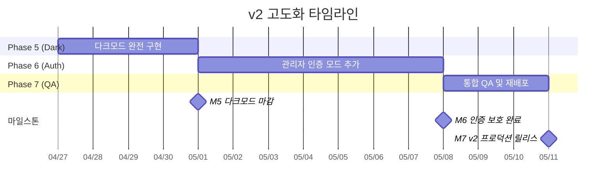

# Notion 기반 견적서 웹 뷰어 개발 로드맵 — v2 고도화

> 최종 업데이트: 2026-04-24 | 버전: v2.0 (초안)
> 선행 로드맵: `docs/roadmap_v1.md` (MVP v1.x — Phase 4 마무리 중)

---

## 개요

v1(MVP)로 완성된 Notion 기반 견적서 웹 뷰어를 **사업자 단독 운영 환경에 안심하고 배포**할 수 있도록 두 가지 축으로 고도화하는 로드맵입니다.

1. **다크모드 완전 구현** — 이미 구성된 `next-themes` 기반 위에서 공개 뷰어·PDF 출력·접근성까지 일관되게 마감합니다.
2. **관리자 인증 모드 추가** — 현재 누구나 열 수 있는 어드민 영역(`/`, `/(dashboard)/**`)을 이메일/패스워드 기반 세션 인증으로 보호합니다. 공개 뷰어(`/quote/[slug]`)는 기존대로 비로그인 접근 유지.

본 로드맵은 v1에서 이미 완료된 작업(`lib/notion.ts`, `InvoiceViewer`, `InvoicePDF`, PDF 다운로드, `CopyUrlButton`, 404, `vercel.json` 등)은 **재작업하지 않는 것을 원칙**으로, 신규 기능과 고도화 작업에만 집중합니다. v2의 기능 ID는 v1(F101~F408)과 혼동을 피하기 위해 **F501~부터 부여**합니다.

---

## 목표 및 성공 지표

### 비즈니스 목표

- 사업자 외 제3자가 어드민 영역에 접근해 고객 정보를 열람할 가능성을 **0건**으로 제거
- 다크모드 사용자가 어드민/뷰어 어느 페이지에서도 **시각적 이질감 없이** 견적서를 열람·관리 가능

### 기술 목표

- 공개 뷰어(`/quote/[slug]`)에서 다크모드와 라이트모드 렌더링이 WCAG 2.1 **AA 대비 비율**(텍스트 4.5:1 이상, 대형 텍스트 3:1 이상)을 충족
- 어드민 영역 전 경로에 미들웨어 기반 세션 인증 적용, 미인증 시 `/login`으로 **서버 사이드 리다이렉트**
- PDF 출력은 다크모드 상태와 무관하게 항상 라이트 톤(흑/백/회색)으로 렌더링 (현재 `InvoicePDF.tsx`가 이미 라이트 고정 — v2에서 계약으로 문서화)
- Edge Runtime 제약을 고려한 미들웨어 설계 (Node.js 전용 API 의존성 회피)

### 측정 가능한 KPI

| 지표 | 목표값 | 측정 방법 |
|---|---|---|
| 다크모드 Lighthouse 접근성 점수 | ≥ 90 | Chrome DevTools Lighthouse (공개 뷰어/어드민) |
| 다크모드 WCAG AA 대비 비율 위반 건수 | 0건 | axe DevTools 자동 감사 |
| 미인증 어드민 접근 차단률 | 100% | 스모크 테스트(`/`, `/invoices`, `/invoices/:id` 미인증 시 `/login` 리다이렉트) |
| 로그인 → 대시보드 LCP | p95 < 2.0s | Vercel Analytics |
| PDF 다운로드 다크모드 영향 | 0건 (항상 라이트) | 수동 교차 검증 (TC-D03) |

---

## 전체 타임라인

전체 기간: **약 2.5주 (버퍼 약 25% 포함)**



### Phase 요약

| Phase | 기간 | 목표 | 마일스톤 |
|---|---|---|---|
| Phase 5 | 약 4일 | 다크모드 완전 구현 (공개 뷰어·PDF 계약·접근성) | M5: 다크모드 마감 |
| Phase 6 | 약 7일 | 관리자 인증 모드 (로그인/세션/미들웨어/보호 라우팅) | M6: 인증 보호 완료 |
| Phase 7 | 약 3일 | 통합 QA, 스모크 테스트, Vercel 환경 변수 갱신 | M7: v2 프로덕션 릴리스 |

---

## Phase 5: 다크모드 완전 구현 (약 4일)

### 목표

v1에서 구성만 해둔 `next-themes` 기반 다크모드를 **어드민/공개 뷰어/PDF/접근성** 네 축에서 완전히 마감한다. 공개 뷰어는 어드민 레이아웃 외부에 위치하므로 테마 토글과 시스템 테마 감지를 별도로 검증해야 하며, PDF는 다크모드 무관 라이트 고정을 명시적 계약으로 문서화한다.

### 주요 태스크

- [x] **F501**: 공개 뷰어 다크모드 적용 및 테마 토글 (복잡도: M) — 우선순위: 🔴 Critical
  - 수용 기준:
    - `/quote/[slug]` 접근 시 시스템 테마(`prefers-color-scheme`)에 따라 자동으로 라이트/다크 적용
    - 공개 뷰어 우상단(PDF 다운로드 버튼 옆)에 `ThemeToggle` 배치, 인쇄 시 `print-hidden`
    - 테마 선택이 `localStorage`에 persist되어 재방문 시 유지
    - 다크모드에서 카드/테이블/구분선/Badge의 시각적 위계가 라이트모드와 동일
  - 기술 구현 방향:
    - `app/quote/[slug]/page.tsx`는 서버 컴포넌트이므로 토글은 클라이언트 컴포넌트(`components/invoice/ViewerThemeToggle.tsx`)로 분리
    - `ThemeProvider`가 이미 루트 레이아웃에 있으므로 별도 Provider 추가 불필요
    - `InvoiceViewer`의 하드코딩 색상(`bg-muted/50`, `text-muted-foreground` 등) 다크모드 대비 재검토
  - 관련 파일:
    - `app/quote/[slug]/page.tsx` (수정 — 토글 배치)
    - `components/invoice/ViewerThemeToggle.tsx` (신규)
    - `components/invoice/InvoiceViewer.tsx` (수정 — 다크 색상 점검)
    - `app/globals.css` (수정 — 필요 시 `@media print` 내부에 `:root.dark` 무효화 보강)

- [x] **F502**: 시스템 테마 자동 감지 및 FOUC 방지 (복잡도: S) — 우선순위: 🟠 High
  - 수용 기준:
    - 최초 방문 시 `defaultTheme="system"` 동작 확인 (이미 `app/layout.tsx`에 설정됨 — 실동작 검증)
    - 하이드레이션 중 테마 깜빡임(FOUC) 없음
    - `<html>`의 `suppressHydrationWarning` 및 `next-themes` 스크립트 우선 주입 확인
    - 공개 뷰어에서도 동일하게 동작
  - 기술 구현 방향:
    - `next-themes`의 `enableSystem` 플래그로 시스템 감지 기본 제공
    - Next.js 16 App Router 환경에서 `next-themes` v0.4.6의 Script 주입 경로 검증 (AGENTS.md의 "NOT the Next.js you know" 경고 유의)
  - 관련 파일: `app/layout.tsx` (검증 중심, 필요 시 수정), `components/providers/theme-provider.tsx`

- [x] **F503**: PDF 라이트 테마 고정 계약 문서화 (복잡도: S) — 우선순위: 🟠 High
  - 수용 기준:
    - `components/invoice/InvoicePDF.tsx`의 styles가 다크모드 상태와 독립적으로 동작함을 단위 검증 (다크모드에서 PDF 다운로드 → 라이트 PDF 확인)
    - `docs/adr/ADR-005-pdf-light-theme-contract.md` 작성: "PDF 출력은 인쇄물 호환성을 위해 항상 라이트 팔레트(#111/#555/#888/#ddd/#fff)로 고정한다" 명시
    - `InvoicePDF.tsx` 상단 주석에 "다크모드 영향 없음" 명시
  - 기술 구현 방향:
    - 현재 `@react-pdf/renderer`는 DOM에서 분리된 렌더러이므로 CSS 클래스/`:root.dark` 영향을 받지 않음 — 코드 변경보다 **계약 문서화와 회귀 테스트**가 핵심
  - 관련 파일:
    - `components/invoice/InvoicePDF.tsx` (주석 추가)
    - `docs/adr/ADR-005-pdf-light-theme-contract.md` (신규)

- [x] **F504**: 어드민 영역 다크모드 일관성 점검 (복잡도: M) — 우선순위: 🟠 High
  - 수용 기준:
    - 모바일 헤더, 사이드바, 대시보드 카드, 목록 필터, 상태 Badge, InvoiceList/InvoiceCard, 스켈레톤 로딩, 빈 상태, ThemeToggle 아이콘 모두 다크모드에서 정상
    - hover/focus-visible 상태가 다크모드에서도 충분한 대비
    - 그림자(`shadow-sm`)가 다크 배경에서도 시각적 깊이 유지(또는 대체)
  - 기술 구현 방향:
    - 각 컴포넌트에서 `bg-white`, `text-gray-*` 등 Tailwind 하드코딩 색상 → semantic token(`bg-background`, `text-muted-foreground`)으로 치환
    - shadcn/ui 기본 토큰이 다크모드에 맞춰 매핑되어 있으므로 일관성 있게 사용
  - 관련 파일(점검 대상):
    - `components/layout/sidebar.tsx`, `components/layout/mobile-sidebar.tsx`
    - `components/invoice/InvoiceList.tsx`, `InvoiceCard.tsx`, `InvoiceFilters.tsx`, `InvoiceListView.tsx`, `InvoiceEmptyState.tsx`
    - `app/(dashboard)/page.tsx`, `app/(dashboard)/invoices/loading.tsx`

- [x] **F505**: 다크모드 WCAG AA 대비 비율 감사 (복잡도: M) — 우선순위: 🟠 High
  - 수용 기준:
    - 공개 뷰어/어드민 모든 주요 화면에 대해 axe DevTools 실행 → Contrast 위반 0건
    - Badge(`secondary`, `destructive`, `outline`) 변형 전부 AA 충족
    - 미세한 `text-muted-foreground` 사용처가 배경 대비 4.5:1 미만인 케이스 리스트업 및 수정
  - 기술 구현 방향:
    - Chrome `axe DevTools` 확장 또는 `@axe-core/react` 개발 시에만 로드
    - 실패 케이스는 `app/globals.css`의 `--muted-foreground` HSL 값 조정
  - 산출물: `docs/qa/dark-mode-audit.md` (체크리스트 + 수정 전후 스크린샷)

- [x] **F506**: 모바일 헤더/사이드바 다크모드 QA (복잡도: S) — 우선순위: 🟡 Medium
  - 수용 기준:
    - iPhone SE(375) / iPhone 14 Pro(393) / iPad(768) 뷰포트에서 다크모드 적용 확인
    - 모바일 헤더의 `ThemeToggle`, `MobileSidebar` 트리거 버튼이 다크 배경에서 충분한 대비
    - Skip Navigation 링크의 focus 상태가 다크모드에서 가시적
  - 산출물: `docs/qa/dark-mode-audit.md`에 병합

### 완료 기준 (Phase 5)

- 공개 뷰어와 어드민 영역 모두에서 라이트/다크 전환이 매끄럽게 동작
- PDF 출력이 테마 상태와 완전히 분리됨을 문서·스크린샷으로 증빙
- axe Contrast 위반 0건

### 마일스톤 M5

> **다크모드 마감** — 어드민과 공개 뷰어 양쪽이 다크모드에서 제품 품질 수준으로 완성.

---

## Phase 6: 관리자 인증 모드 추가 (약 7일)

### 목표

어드민 영역(`/`, `/(dashboard)/**`)을 이메일/패스워드 기반 로그인으로 보호한다. 1인 사업자 전제이므로 사용자 DB 없이 환경 변수에 저장된 단일 계정으로 운영하며, 세션은 JWT 쿠키로 관리한다. 공개 뷰어(`/quote/[slug]`)는 인증 대상에서 제외한다.

### 주요 태스크

- [x] **F601**: 인증 라이브러리 선정 ADR 작성 (복잡도: S) — 우선순위: 🔴 Critical
  - 수용 기준:
    - `docs/adr/ADR-006-auth-library.md` 작성
    - NextAuth.js v5(Auth.js) / Lucia Auth / 직접 구현 세 가지 옵션의 장단점 비교
    - Edge Runtime 호환성, Next.js 16 App Router 지원, 1인 사업자 환경 적합성 기준
    - 최종 선택과 근거 명시
  - 권장 결론 (ADR 검토 전 잠정 권장):
    - **직접 구현** (`jose` 기반 JWT + HTTP-only 쿠키 + `bcrypt` 패스워드 해시)
    - 이유: ① DB 불필요(1인 사업자 단일 계정), ② NextAuth v5는 Next.js 16 최신 버전과의 breaking change 여지, ③ Lucia는 2025년 유지보수 모드 전환 발표로 리스크, ④ 요구사항이 단순(단일 계정 로그인)해서 의존성 추가 대비 자체 구현이 더 투명
    - 최종 결정은 F601 ADR 심사에서 확정
  - 관련 파일: `docs/adr/ADR-006-auth-library.md` (신규)

- [x] **F602**: 인증 환경 변수 및 계정 설정 (복잡도: S) — 우선순위: 🔴 Critical
  - 수용 기준:
    - `.env.local.example`에 인증 관련 변수 추가 및 설명:
      - `ADMIN_EMAIL` — 어드민 이메일
      - `ADMIN_PASSWORD_HASH` — bcrypt 해시(평문 금지)
      - `AUTH_SECRET` — JWT 서명용 랜덤 문자열(32바이트 이상 권장)
      - `AUTH_COOKIE_NAME` — 세션 쿠키명 (기본값 `admin_session`)
      - `AUTH_SESSION_MAX_AGE` — 세션 유효기간 초 단위 (기본값 `604800` = 7일)
    - `README.md`에 패스워드 해시 생성 스니펫(`node -e "console.log(bcrypt.hashSync('pw', 12))"`) 포함
    - 환경 변수 누락 시 빌드 단계에서 한국어 에러 노출 (`lib/env.ts`의 `getRequiredEnv` 재활용)
  - 관련 파일: `.env.local.example`, `README.md`, `lib/env.ts` (기존 확장)

- [x] **F603**: 인증 도메인 레이어 구현 (복잡도: M) — 우선순위: 🔴 Critical
  - 수용 기준:
    - `lib/auth/session.ts`에 다음 함수 정의:
      - `verifyCredentials(email: string, password: string): Promise<boolean>` — bcrypt compare
      - `createSessionToken(payload: SessionPayload): Promise<string>` — jose JWT 서명
      - `verifySessionToken(token: string): Promise<SessionPayload | null>` — JWT 검증 + 만료 체크
      - `getCurrentSession(): Promise<SessionPayload | null>` — Next.js `cookies()` 기반 서버 전용
    - `lib/auth/types.ts`에 `SessionPayload` 인터페이스(`email`, `iat`, `exp`)
    - Zod 스키마로 로그인 폼 검증 (`lib/schemas/auth.ts` — `LoginSchema`: email/password)
    - any 타입 금지, 테스트 수동 검증 통과
  - 기술 구현 방향:
    - `jose` (Edge 호환) + `bcryptjs`(Edge 호환 포크) 또는 `bcrypt`(Node 전용) 선택 — ADR-006 결정 반영
    - JWT 페이로드는 이메일만 포함, 만료는 `exp` 클레임으로 관리
  - 관련 파일:
    - `lib/auth/session.ts` (신규)
    - `lib/auth/types.ts` (신규)
    - `lib/schemas/auth.ts` (신규)
    - `types/index.ts` (필요 시 `SessionPayload` export)

- [x] **F604**: 로그인 페이지 UI (복잡도: M) — 우선순위: 🔴 Critical
  - 수용 기준:
    - 경로: `/login` — 어드민 레이아웃 밖(공개 뷰어처럼 루트 레이아웃만 사용)
    - 이메일/패스워드 입력 폼(shadcn Card + React Hook Form + Zod)
    - 실패 시 한국어 에러 메시지("이메일 또는 비밀번호가 올바르지 않습니다")
    - 라이트/다크 모드 양쪽에서 렌더링 확인
    - `?redirect=` 쿼리파라미터가 있을 경우 로그인 성공 후 해당 경로로 이동(화이트리스트 검증 필수 — 오픈 리다이렉트 방지)
    - 반응형 (모바일 375px 이상)
  - 기술 구현 방향:
    - 서버 액션(`app/login/actions.ts` 또는 `/api/auth/login` Route Handler) — ADR-006에서 결정
    - React Hook Form `useForm` + `zodResolver(LoginSchema)`
    - 로그인 성공 시 `Set-Cookie`로 HTTP-only 세션 쿠키 발급, `redirect()` 호출
  - 관련 파일:
    - `app/login/page.tsx` (신규 — 서버 컴포넌트 + 클라이언트 폼 import)
    - `app/login/LoginForm.tsx` (신규 — 클라이언트 컴포넌트)
    - `app/login/actions.ts` (신규 — 서버 액션)
    - `components/ui/input.tsx`, `components/ui/label.tsx` (shadcn 미추가 시 설치)
  - 필요한 외부 패키지:
    - `bcryptjs` 또는 `bcrypt` (ADR-006 결정 반영)
    - `jose` (Edge 호환 JWT)

- [x] **F605**: 로그아웃 기능 (복잡도: S) — 우선순위: 🟠 High
  - 수용 기준:
    - 사이드바 하단(ThemeToggle 옆 또는 아래)에 로그아웃 버튼 배치
    - 클릭 시 세션 쿠키 삭제 + `/login`으로 리다이렉트
    - 서버 액션 기반(`app/logout/actions.ts` 또는 `/api/auth/logout`)
    - 모바일 사이드바에서도 동일하게 접근 가능
  - 기술 구현 방향: 서버 액션에서 `cookies().delete(AUTH_COOKIE_NAME)` → `redirect("/login")`
  - 관련 파일:
    - `components/layout/sidebar.tsx` (수정)
    - `components/layout/mobile-sidebar.tsx` (수정)
    - `components/layout/LogoutButton.tsx` (신규)
    - `app/logout/actions.ts` (신규)

- [x] **F606**: 미들웨어 기반 라우트 보호 (복잡도: L) — 우선순위: 🔴 Critical
  - 수용 기준:
    - `middleware.ts` 생성
    - 보호 대상: `/` (대시보드), `/invoices/**`, `/(dashboard)/**`의 모든 내부 경로
    - 미보호 대상(명시적 화이트리스트): `/login`, `/quote/**`, `/_next/**`, `/fonts/**`, `/favicon.ico`, `/api/auth/**`
    - 미인증 접근 시 `/login?redirect=<원래경로>`로 307 리다이렉트
    - 로그인 상태로 `/login` 접근 시 `/`(대시보드)로 리다이렉트
    - Edge Runtime에서 정상 동작 (Node.js 전용 API 미사용)
  - 기술 구현 방향:
    - `middleware.ts`에서 `cookies.get(AUTH_COOKIE_NAME)` → `verifySessionToken` 호출
    - JWT 검증은 `jose`(Edge 호환) 사용 — `bcrypt` 같은 Node 전용 API는 미들웨어에서 호출 금지(로그인 검증은 서버 액션/Route Handler에서만)
    - `matcher` 패턴으로 정적 자산 제외:
      ```ts
      export const config = {
        matcher: ["/((?!login|quote|_next|fonts|favicon.ico|api/auth).*)"],
      }
      ```
  - 관련 파일:
    - `middleware.ts` (신규 — 프로젝트 루트)
    - `lib/auth/session.ts` (Edge 호환 검증 함수 재사용)

- [x] **F607**: 세션 만료 처리 및 자동 리다이렉트 (복잡도: M) — 우선순위: 🟠 High
  - 수용 기준:
    - JWT `exp` 클레임 초과 시 미들웨어가 자동으로 쿠키 무효화 + `/login` 리다이렉트
    - 세션 만료 안내 메시지 표시(`/login?reason=expired` → "세션이 만료되어 다시 로그인이 필요합니다")
    - 쿠키 속성: `HttpOnly`, `Secure`(프로덕션), `SameSite=Lax`, `Path=/`
    - 개발 환경에서는 `Secure` 플래그 조건부(`NODE_ENV === "production"`)
  - 기술 구현 방향:
    - `createSessionToken`에서 `exp` 클레임 설정(현재 시각 + `AUTH_SESSION_MAX_AGE` 초)
    - `verifySessionToken`에서 jose의 `verifyJwt` 호출 시 자체적으로 `exp` 검증
    - 미들웨어에서 검증 실패 시 `response.cookies.delete(...)` 후 리다이렉트
  - 관련 파일: `middleware.ts`, `lib/auth/session.ts`, `app/login/page.tsx` (reason 쿼리 표시)

- [x] **F608**: 어드민 서버 컴포넌트에 세션 체크 보조 함수 제공 (복잡도: S) — 우선순위: 🟡 Medium
  - 수용 기준:
    - `lib/auth/requireAuth.ts`에 `requireAuth()` 유틸 — 미인증 시 `redirect("/login")`, 인증 시 `SessionPayload` 반환
    - `app/(dashboard)/layout.tsx`에서 호출하여 이중 방어 레이어 구축 (미들웨어 + 레이아웃 가드)
    - 향후 서버 액션에서 `requireAuth()` 재사용 가능한 구조
  - 기술 구현 방향:
    - Next.js 16 `redirect()` 함수는 서버 컴포넌트/액션에서만 호출 가능 — import 경로 주의(`next/navigation`)
  - 관련 파일:
    - `lib/auth/requireAuth.ts` (신규)
    - `app/(dashboard)/layout.tsx` (수정)

- [x] **F609**: 로그인 실패 레이트 리밋 (복잡도: M) — 우선순위: 🟡 Medium (Nice-to-have)
  - 수용 기준:
    - 동일 IP 기준 5분간 5회 이상 로그인 실패 시 1분 간격 쿨다운
    - 실패 카운트는 **인메모리 Map**(단일 Vercel 인스턴스 전제)로 관리, 서버리스 재시작 시 초기화 허용
    - 한계는 `docs/qa/auth-security.md`에 명시(프로덕션 스케일업 시 Upstash Redis 등 외부 스토어 필요)
  - 기술 구현 방향:
    - 서버 액션 내부에서 `request` 헤더의 `x-forwarded-for` 또는 Vercel `geolocation` 헤더 활용
    - 1인 사업자 환경이므로 완벽한 분산 저장 불필요, MVP 수준 보호만 적용
  - 비고: 복잡도/일정에 따라 Phase 7로 이월 가능
  - 관련 파일: `app/login/actions.ts`, `lib/auth/rate-limit.ts` (신규)

- [x] **F610**: 공개 뷰어 비인증 접근 회귀 검증 (복잡도: S) — 우선순위: 🔴 Critical
  - 수용 기준:
    - 로그아웃 상태(쿠키 없음)에서 `/quote/[slug]` 정상 접근 가능
    - 로그아웃 상태에서 PDF 다운로드 정상 동작
    - 미들웨어 matcher가 `/quote/**`를 확실히 제외함을 스모크 테스트로 검증
  - 기술 구현 방향:
    - F406 이후 프로덕션 배포 환경에서도 시크릿 탭으로 회귀 테스트
  - 산출물: `docs/qa/auth-security.md`의 회귀 테스트 섹션

### 완료 기준 (Phase 6)

- 로그인 → 대시보드 → 로그아웃 전체 여정이 데스크톱/모바일에서 정상 동작
- 미인증 어드민 접근이 100% 차단되고 `/login`으로 리다이렉트
- 공개 뷰어/PDF 다운로드가 비로그인 상태에서도 정상
- Edge Runtime에서 미들웨어가 에러 없이 동작 (Vercel 빌드 성공)

### 마일스톤 M6

> **인증 보호 완료** — 어드민 영역이 완전히 보호된 상태로 1인 사업자 운영 가능.

---

## Phase 7: 통합 QA 및 재배포 (약 3일)

### 목표

v2의 두 축(다크모드·인증)이 서로 간섭 없이 동작하는지 통합 검증하고, Vercel 프로덕션 환경 변수를 갱신하여 재배포한다.

### 주요 태스크

- [ ] **F701**: Vercel 환경 변수 추가 및 재배포 (복잡도: S) — 우선순위: 🔴 Critical
  - 수용 기준:
    - Vercel 대시보드 Production/Preview/Development 환경에 `ADMIN_EMAIL`, `ADMIN_PASSWORD_HASH`, `AUTH_SECRET`, `AUTH_COOKIE_NAME`(선택), `AUTH_SESSION_MAX_AGE`(선택) 등록
    - `vercel.json` 보안 헤더 유지(v1에서 설정됨), `/login`에도 동일하게 적용되는지 확인
    - main 브랜치 머지 후 배포 로그에서 미들웨어 에러 0건
  - 비고: v1의 F406 완료가 선행 조건. v1 F406이 아직 진행 중이면 v2 배포 시 함께 처리

- [ ] **F702**: 통합 스모크 테스트 (복잡도: M) — 우선순위: 🔴 Critical
  - 수용 기준 (체크리스트 TC-V01 ~ TC-V10):
    - TC-V01: 비로그인 상태 `/` → `/login?redirect=/` 리다이렉트
    - TC-V02: 비로그인 상태 `/invoices` → `/login?redirect=/invoices` 리다이렉트
    - TC-V03: 로그인(유효 계정) 성공 → `/` 대시보드 진입
    - TC-V04: 로그인(잘못된 비번) 실패 → 에러 메시지 표시, 쿠키 미발급
    - TC-V05: 로그아웃 → 쿠키 삭제 → `/` 접근 시 `/login` 리다이렉트
    - TC-V06: 세션 만료(수동 테스트: `AUTH_SESSION_MAX_AGE=60`으로 임시 설정) → 재접근 시 `/login?reason=expired`
    - TC-V07: 비로그인 상태 `/quote/[slug]` 정상 열람 + PDF 다운로드 정상
    - TC-V08: 다크모드에서 모든 어드민 페이지 및 공개 뷰어 시각 확인
    - TC-V09: PDF 다운로드가 다크/라이트 양쪽에서 동일한 라이트 PDF 생성
    - TC-V10: 모바일(iPhone Safari)에서 로그인 → 대시보드 → 로그아웃 여정
  - 산출물: `docs/qa/v2-smoke-test.md`

- [ ] **F703**: 보안 리뷰 및 문서 업데이트 (복잡도: S) — 우선순위: 🟠 High
  - 수용 기준:
    - `docs/qa/auth-security.md`: 쿠키 속성, JWT 서명 알고리즘(HS256), 오픈 리다이렉트 방지 전략, bcrypt cost factor(12 권장), 레이트 리밋 한계 명시
    - `CLAUDE.md`의 "설치된 주요 패키지" 섹션에 `jose`, `bcryptjs`(또는 `bcrypt`) 추가
    - `CLAUDE.md`의 라우팅 구조 섹션에 `/login`, `middleware.ts` 추가
    - `README.md`에 "어드민 계정 생성 방법" 섹션 추가 (패스워드 해시 생성 스니펫 포함)
  - 관련 파일: `docs/qa/auth-security.md` (신규), `CLAUDE.md`, `README.md`

- [ ] **F704**: Lighthouse 재측정 (복잡도: S) — 우선순위: 🟡 Medium
  - 수용 기준:
    - 공개 뷰어/어드민/로그인 페이지 Lighthouse Accessibility ≥ 90
    - 다크모드/라이트모드 양쪽 측정
    - 결과를 `docs/qa/lighthouse-v2.md`에 기록
  - 관련 파일: `docs/qa/lighthouse-v2.md` (신규)

### 완료 기준 (Phase 7)

- TC-V01 ~ TC-V10 모두 통과
- Vercel 프로덕션 URL에서 다크모드·인증 모두 정상
- 모든 신규 ADR 및 QA 문서 인계 완료

### 마일스톤 M7

> **v2 프로덕션 릴리스** — 다크모드 완성 + 인증 보호 상태로 사업자 독립 운영 가능.

---

## 기술 아키텍처 결정사항 (ADR)

v1 ADR은 `docs/roadmap_v1.md` 참고. v2에서 신규 작성 예정인 ADR:

| ID | 제목 | 상태 | 요약 |
|---|---|---|---|
| ADR-005 | PDF 라이트 테마 고정 계약 | **완료** | PDF 출력은 다크모드 상태와 무관하게 `#111/#555/#888/#ddd/#fff` 라이트 팔레트로 고정 |
| ADR-006 | 인증 라이브러리 선정 | **완료** | jose + bcryptjs 직접 구현 확정. Edge Runtime 호환, DB 불필요, 단순 요구사항에 최적 |

### ADR-006 비교 프레임(F601 심사용)

| 기준 | NextAuth.js v5 (Auth.js) | Lucia Auth | 직접 구현 (`jose` + `bcryptjs`) |
|---|---|---|---|
| Next.js 16 App Router 지원 | ✅ (검증 필요) | ⚠️ (유지보수 모드 전환 예정) | ✅ 완전 제어 |
| Edge Runtime 호환 | 부분(Adapter 의존) | 부분 | ✅ (jose만 사용) |
| DB 필요 여부 | 세션 전략(DB/JWT)에 따라 다름 | 세션 DB 필요 | 불필요 |
| 1인 사업자 단일 계정 적합성 | 과한 추상화 | 과한 추상화 | 최적 |
| 의존성 부담 | 큼 | 중 | 작음(2개) |
| 커뮤니티/장래성 | ✅ | ⚠️ | 자체 유지 필요 |
| Next.js 16 breaking change 리스크 | 🟠 중간 | 🟠 중간 | 🟢 낮음 |

---

## 리스크 및 의존성

| 리스크 | 영향도 | 가능성 | 대응 방안 |
|---|---|---|---|
| Vercel Edge Runtime에서 `bcrypt`(Node 네이티브) 호출 시 런타임 에러 | 🔴 High | 🟠 중간 | 미들웨어에서는 JWT 검증만 수행(`jose`). bcrypt compare는 서버 액션/Route Handler(Node runtime)에서만. ADR-006에서 명시 |
| Next.js 16의 `middleware.ts` API 변경 가능성 | 🟠 Medium | 🟠 중간 | Phase 6 시작 시 `node_modules/next/dist/docs/` 내 middleware 문서 재확인. AGENTS.md 경고 준수 |
| `next-themes` v0.4.6와 Next.js 16 App Router 호환성 이슈 | 🟠 Medium | 🟡 낮음 | v1에서 이미 `ThemeProvider` 동작 중 — Phase 5 F502에서 FOUC/하이드레이션 재검증 |
| 오픈 리다이렉트 취약점 (`?redirect=` 파라미터) | 🔴 High | 🟠 중간 | F604에서 redirect 값을 "내부 경로"로 화이트리스트 검증(시작이 `/`이고 `//` 또는 `http://` 포함 금지) |
| 단일 계정 비밀번호 유출 시 전체 어드민 노출 | 🔴 High | 🟡 낮음 | `AUTH_SECRET` 주기적 교체 권장 문서화. 향후 2FA는 v2.1 범위 |
| 공개 뷰어가 미들웨어 matcher에서 의도치 않게 포함 | 🔴 High | 🟡 낮음 | F610 회귀 테스트로 확실히 확인. matcher 변경 시 항상 TC-V07 재실행 |
| 다크모드 하드코딩 색상 잔존으로 일부 화면만 깨짐 | 🟠 Medium | 🟠 중간 | F504에서 Grep으로 `bg-white`, `text-gray-`, `bg-black`, `#fff`, `#000` 하드코딩 전수 감사 |
| JWT secret 환경 변수 유출 | 🔴 High | 🟡 낮음 | `.env.local`을 `.gitignore`에 포함(확인 필요). Vercel 환경 변수는 대시보드에서만 관리 |
| 서버리스 환경에서 인메모리 레이트 리밋 미작동 | 🟡 Low | 🟠 중간 | F609의 MVP 수준 한계 명시. 트래픽 증가 시 Upstash Redis 도입을 v2.1 후보로 기록 |

---

## 미결 사항 및 가정

v2 범위 내에서 사업자 확인이 필요한 사항:

### 비즈니스 규칙

- [ ] **다중 어드민 계정 필요 여부**: 현재 가정은 1인 사업자 단일 계정. 팀 확장 시 DB 기반 사용자 테이블 필요 — v2.1 후보
- [ ] **비밀번호 재설정 기능**: 현재 가정은 환경 변수 직접 수정. 이메일 기반 재설정은 v2 범위 외
- [ ] **"기억하기(Remember Me)" 옵션**: 현재 가정은 세션 기간을 고정 7일로 처리. 사업자가 기간 선택을 원하면 F607 수정 필요
- [ ] **로그인 기록/감사 로그**: 누가 언제 로그인했는지 기록 필요성 — 가정: MVP 범위 외, Vercel 로그로 대체

### 기술적 결정

- [ ] **인증 라이브러리 최종 선정**: F601 ADR-006 심사 결과에 따라 확정 (잠정 권장: `jose` + `bcryptjs` 직접 구현)
- [ ] **bcrypt cost factor**: 권장 12, 성능 이슈 시 10까지 허용 — F603에서 확정
- [ ] **세션 저장 방식**: JWT(쿠키에 저장, 상태 비저장) vs DB 세션 — JWT 권장(서버리스 적합)
- [ ] **2FA 도입 여부**: 가정은 v2 범위 외, v2.1 후보
- [ ] **다크모드 시스템 외 수동 토글의 persist 범위**: `localStorage` only vs 쿠키 동기화 — 가정: `next-themes` 기본값(localStorage) 유지

### 접근성/성능

- [ ] **다크모드 전환 애니메이션**: 현재 `disableTransitionOnChange` 설정 — 사용자 선호도 확인 필요
- [ ] **공개 뷰어에 테마 토글 노출 여부**: F501은 노출을 전제로 함. 사업자가 "고객은 항상 시스템 테마 자동"을 원할 경우 토글 제거(시스템 감지만 유지)

---

## 자기 검증 체크리스트

로드맵 작성자가 최종 확인한 항목:

- [x] v1 완료 항목과 중복되지 않음 (PDF 라이트 고정은 이미 `InvoicePDF.tsx`에 구현 — v2에서는 계약 문서화에 집중)
- [x] v2 요구사항(다크모드 완전 구현 + 관리자 인증) 모두 Phase 5/6에 반영
- [x] Phase별 독립적 가치 전달 (M5: 다크마감 / M6: 인증보호 / M7: 통합 릴리스)
- [x] 기술 스택(Next.js 16, React 19, TS strict, Tailwind v4, shadcn/ui, Zod) 일치, any 타입 금지 준수
- [x] 리스크(Edge Runtime, 오픈 리다이렉트, Next.js 16 breaking change) 명시 및 대응
- [x] 인증 라이브러리 ADR 프레임 제공으로 즉시 심사 가능
- [x] 공개 뷰어/PDF의 비로그인 접근 보장(F610 회귀 테스트) — v1 동작 비파괴 명시
- [x] 현실적 일정(총 약 2.5주, 버퍼 25%)

---

## 변경 이력

| 날짜 | 버전 | 변경자 | 내용 |
|---|---|---|---|
| 2026-04-24 | v2.0 | 로드맵 초안 | v2 고도화 로드맵 신규 작성. Phase 5(다크모드)/6(인증)/7(통합 QA) 구성, F501~F704 태스크 정의, ADR-005/006 프레임 수립 |
| 2026-04-24 | v2.1 | Phase 5 완료 | F501~F506 모두 완료. Playwright 검증: 라이트/다크 전환, 모바일 사이드바 ThemeToggle, 어드민 다크모드 일관성, ADR-005 문서화 확인. Phase 6(인증) 착수 예정 |
| 2026-04-24 | v2.2 | Phase 6 완료 | F601~F610 모두 완료. jose+bcryptjs 직접 구현(ADR-006). middleware.ts Edge Runtime 라우트 보호, /login 페이지(RHF+Zod), 로그아웃, requireAuth 이중 방어, 레이트 리밋(인메모리 Map), /quote/** 비인증 접근 회귀 검증(Playwright). Phase 7(통합 QA) 착수 예정 |
